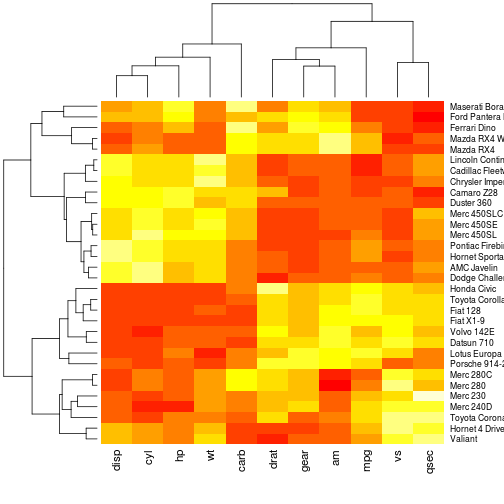
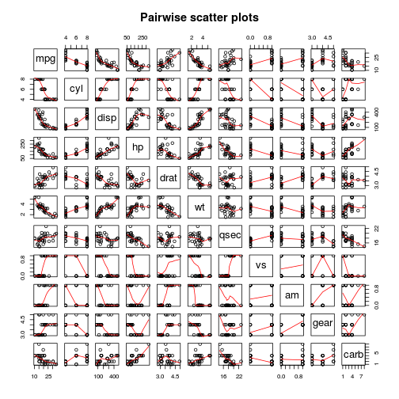

## Motivation

1. Do you want to buy a car with high efficiency of gas usage?
2. Do you want to test if your beloved car is still healthy without eating too much gas?
3. Do you want to show your dream girl/boy that you have a strong mind that you would try things yourself in a scientific way rather than taking numbers that dealer told you?

### Here is the small piece of info which helps you to predict the gas efficiency of the car in question..

--- .class #id 

## Glance at the Original Data
We use mtcars dataset from r to build our model

```
##                    mpg cyl disp  hp drat    wt  qsec vs am gear carb
## Mazda RX4         21.0   6  160 110 3.90 2.620 16.46  0  1    4    4
## Mazda RX4 Wag     21.0   6  160 110 3.90 2.875 17.02  0  1    4    4
## Datsun 710        22.8   4  108  93 3.85 2.320 18.61  1  1    4    1
## Hornet 4 Drive    21.4   6  258 110 3.08 3.215 19.44  1  0    3    1
## Hornet Sportabout 18.7   8  360 175 3.15 3.440 17.02  0  0    3    2
## Valiant           18.1   6  225 105 2.76 3.460 20.22  1  0    3    1
```

```
## [1] 32 11
```

```
##  [1] "mpg"  "cyl"  "disp" "hp"   "drat" "wt"   "qsec" "vs"   "am"   "gear"
## [11] "carb"
```

---

## Exploratory Analysis I
### Heatmap shows relationships between different variables
 

---

## Exploratory Analysis II
### Pairwise plots shows correlations between different variables further
 

---

## Model builder
We will use regression model to build prediction algorithm. We start from throwing all variables into the equation

```r
mtcars2 <- mutate(mtcars, cyl=as.factor(cyl), vs=as.factor(vs), am=as.factor(am),
                  gear=as.factor(gear), carb=as.factor(carb))
```

```
## Error in eval(expr, envir, enclos): could not find function "mutate"
```

```r
r0<-lm(mpg~., data=mtcars2)
```

```
## Error in is.data.frame(data): object 'mtcars2' not found
```

```r
#summary(r0)$coef
summary(r0)$r.squared
```

```
## Error in summary(r0): object 'r0' not found
```
Good R squrare!! But due to many varibles are corelating to each other and we will be able to simplify this a lot!

---

### We use step function to serach for more combinations of variable we will use in regression equation

```
## Error in terms(object): object 'r0' not found
```

```r
summary(rsearch)$coef
```

```
## Error in summary(rsearch): object 'rsearch' not found
```

```r
summary(rsearch)$r.squared
```

```
## Error in summary(rsearch): object 'rsearch' not found
```
Good enough prediction with only three variables!

---

## Final Conclusion
According to fitted model:
E(mpg) = 9.723 - 2.937 * wt + 1.017 * qsec + 14.079 * am1 - 4.141 * wt * am1
mannual: am1 = 1
automatic: am1 = 0

So if you know your car's weight (wt), 1/4 mile time (qsec), and transmission type, you will be able tell roughly how much miles you car can run with 1 gallon gas!
